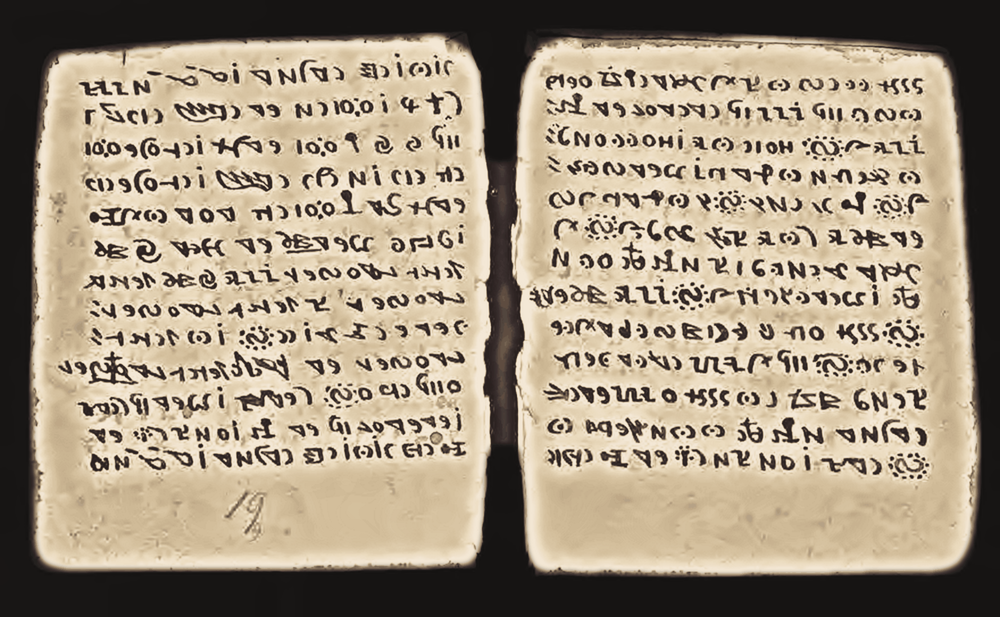
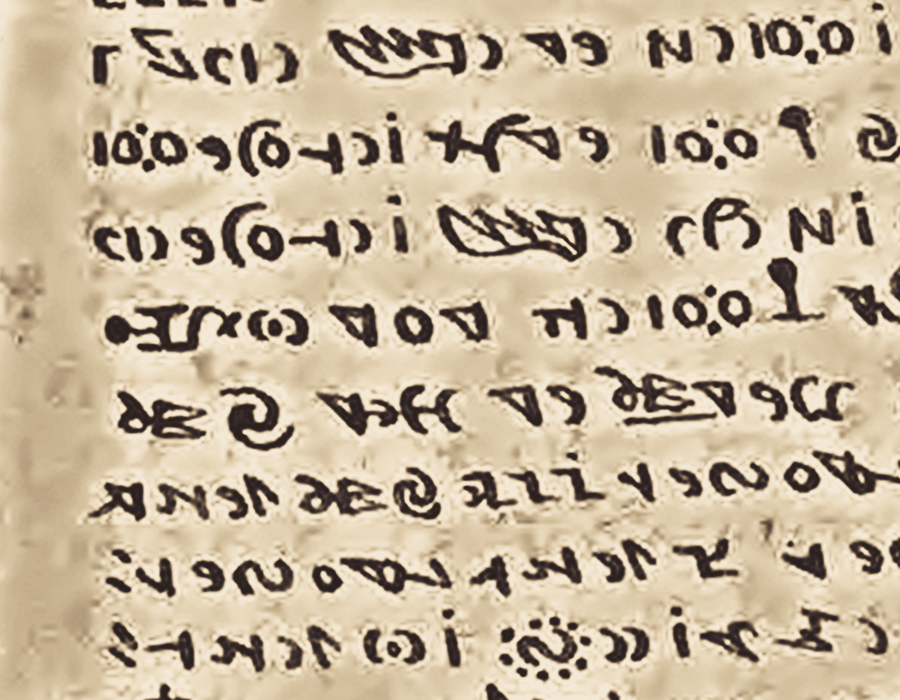

# Codex Rohonczi — restoration & synthetic colorization pipeline

A reproducible Python pipeline that acquires the Rohonc Codex (MS K 114) scans from the MTAK
REAL-MS repository, denoises and contrast-isolates them, applies a deterministic parchment /
iron-gall colour mapping, and recompiles a single facsimile PDF.

Source record: <https://real-ms.mtak.hu/80/>

| | |
| --- | --- |
| Pages | 227 |
| Output | 300 DPI colour facsimile PDF |
| Runtime | ~5 min on 8 cores (download → PDF) |
| Colour | synthetic (see caveats) |

## Sample output

Restored spread (folio 20) and a 1:1 detail crop:





## Results in this repository

- [`results/Codex_Rohonczi_Restored_compact.pdf`](results/Codex_Rohonczi_Restored_compact.pdf) —
  227 pages, 150 DPI, JPEG q90, ~57 MB. Committed so the output is available without rerunning.
- The lossless 300 DPI master (`Codex_Rohonczi_Restored.pdf`, ~400 MB) is **not** committed: it
  exceeds GitHub's 100 MB per-file limit. It is published as a **release asset** instead — see
  [Releases](../../releases) — or rerun `run_pipeline.py` to regenerate it locally.

### Publishing a release

`.github/workflows/release.yml` rebuilds both PDFs from scratch on a runner and attaches them to a
release. Trigger it by pushing a tag, or manually:

```bash
git tag v1.0.0 && git push origin v1.0.0   # tag push
gh workflow run release.yml -f tag=v1.0.0  # or manual dispatch
```

Re-running against an existing tag re-uploads the assets with `--clobber`. Release notes come from
`.github/release-notes.md`. It is the only workflow in the repository — there is no CI on push.

## Caveats you should read before using the output

The repository holds two documents for eprint 80:

| document | resolution | access |
| --- | --- | --- |
| `Rohonci_Codex_K_114.pdf` (39 MB) | high resolution, **colour** | `staffonly` — HTTP 401 without MTAK credentials |
| `Rohonci_Codex_K_114cs.pdf` (11 MB) | low resolution, **monochrome** | `public` (gratis OA) |

Only the public monochrome copy is downloadable, so the pipeline runs on a ~100 DPI
microfilm-grade grayscale scan. Therefore:

- **Colour is synthetic, not recovered.** It is a deterministic per-pixel mapping applied to a
  monochrome scan — a legibility and presentation aid, not a scholarly colour reproduction. Do not
  cite it as evidence about the manuscript's actual pigments.
- **300 DPI is a resample, not new detail.** Pages are extracted at their native ~100 DPI so that
  denoising and contrast work on real pixels; a single 3x Lanczos resample with light unsharp
  masking happens after cleanup, at the end of the per-page chain.
- **No glyph is invented.** Nothing in the chain adds or removes stroke structure.

If MTAK credentials for the high-resolution colour document become available, add `requests` basic
auth in `pipeline/acquire.py`; the rest of the pipeline is unchanged, and `--scale 1.0` should then
be used since the source would already exceed 300 DPI.

## Pipeline

1. **`pipeline/acquire.py`** — parses the EPrints landing page with `requests` + BeautifulSoup,
   reports each document's declared resolution and access level from the repository's JSON export,
   and downloads every PDF segment (restricted segments are skipped with a warning, and payloads
   are validated by `%PDF-` signature so HTML error pages are never mistaken for scans).
2. **`pipeline/extract.py`** — renders every page to lossless grayscale PNG via PyMuPDF, named
   `<pdf-stem>_<page:04d>.png` to preserve original pagination.
3. **`pipeline/restore.py`** — per page, run asynchronously over a process pool:
   - *Cleanup:* `cv2.fastNlMeansDenoising` at low strength (`h=4`) removes microfilm grain without
     smearing parchment texture.
   - *Isolation:* illumination flattening (divide by a large-radius blur), CLAHE (`clipLimit=1.4`,
     8x8 tiles), then a 1–99 percentile stretch measured inside the leaf only. A folio mask (Otsu
     + morphology + connected-component filtering, which keeps both leaves of a spread) separates
     the leaf from the photographic backdrop.
   - *Colorization:* the leaf's own luminance is mapped through a duotone ramp running from
     oxidised iron-gall ink (`#3B2F2F`) through warm mid-tones to parchment (`#F4E8D6`), so every
     fibre, stain and stroke edge in the photograph carries into colour. The backdrop stays a
     neutral dark so nothing outside the leaf is invented, and binding/cover shots are detected
     (low folio coverage or dark interior) and mapped onto a leather ramp instead.
4. **`pipeline/compile_pdf.py`** — reassembles the pages with `img2pdf` at 300 DPI, using
   palette-reduced Flate (lossless pixel path) for the master or JPEG for the compact copy.

### Design notes

**Why the first attempt was thrown away.** An earlier revision thresholded the ink into a mask and
composited it over procedurally generated parchment. Replacing real paper with synthetic texture
looked plastic and destroyed exactly the surface detail worth keeping, so the folio interior is now
a tone-map of the actual scan luminance.

**Why no GAN.** The intended GAN/diffusion restoration step was dropped deliberately: this machine
has no GPU, and a generative model given a 100 DPI monochrome scan hallucinates glyph shapes —
unacceptable for an undeciphered manuscript where stroke topology is the entire research object.

## Usage

```bash
pip install -r requirements.txt

python run_pipeline.py                  # acquire → extract → restore → compile
python run_pipeline.py --skip-download  # reuse data/raw
```

Individual stages, if you want to re-tune one without redoing the others:

```bash
python pipeline/acquire.py     --out data/raw
python pipeline/extract.py     --out data/pages
python pipeline/restore.py     --workers 8
python pipeline/compile_pdf.py --dpi 300 --colors 128 --out Codex_Rohonczi_Restored.pdf
python pipeline/compile_pdf.py --dpi 300 --jpeg-quality 90 --scale 0.5 \
                               --out results/Codex_Rohonczi_Restored_compact.pdf
```

Intermediate artefacts land in `data/` (git-ignored): `data/raw` for source PDFs, `data/pages` for
native-resolution extractions, `data/processed` for restored pages.

## Requirements

Python 3.11+ and the pinned dependencies in `requirements.txt` (`requests`, `beautifulsoup4`,
`pymupdf`, `opencv-python-headless`, `numpy`, `pillow`, `img2pdf`). No GPU needed.

## Attribution

The Rohonc Codex itself is a 16th-century manuscript in the public domain. The source scans are
published by the Library and Information Centre of the Hungarian Academy of Sciences (MTA KIK /
MTAK) in the REAL-MS repository; the derived images here remain subject to whatever terms MTAK
applies to that record. Please cite the repository record when reusing the output.
